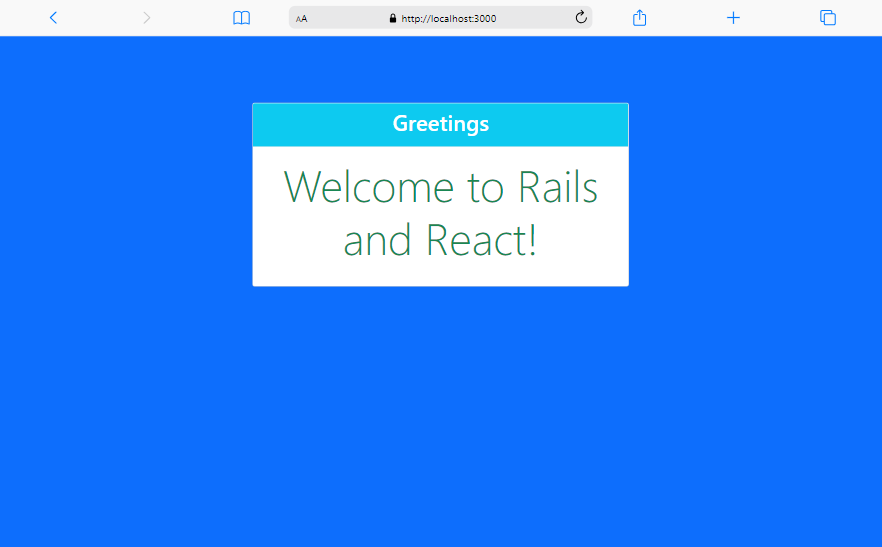

> # Hello Rails React

| Project Login Page |
|---------------------------------------|
|<div align="center" width="auto"></div>|


<a name="readme-top"></a>

<!-- TABLE OF CONTENTS -->

# 📗 Table of Contents

- [📖 About the Project](#about-project)
  - [🛠 Built With](#built-with)
    - [Tech Stack](#tech-stack)
    - [Key Features](#key-features)
   - [🚀 Live Demo](#live-demo)
- [💻 Getting Started](#getting-started)
  - [Setup](#setup)
  - [Prerequisites](#prerequisites)
  - [Install](#install)
  - [Usage](#usage)
  - [Run tests](#run-tests)
- [👥 Authors](#authors)
- [🔭 Future Features](#future-features)
- [🤝 Contributing](#contributing)
- [⭐️ Show your support](#support)
- [🙏 Acknowledgements](#acknowledgements)
- [📝 License](#license)

<!-- PROJECT DESCRIPTION -->

# 📖 [Hello Rails React] <a name="about-project"></a>

> **[Hello-Rails-React]** is a Rails application that integrates React with Webpack, utilizing the jsbundling-rails gem. It features a Postgres database for storing five different greetings, with an API endpoint to retrieve a random greeting, all while having a static root view.
## 🛠 Built With <a name="built-with"></a>

### Tech Stack <a name="tech-stack"></a>

<details>
  <summary>Client</summary>
  <ul>
    <li><a href="https://www.w3schools.com/html/default.asp">HTML</a></li>
    <li><a href="https://www.w3schools.com/css/default.asp">CSS</a></li>
    <li><a href="https://getbootstrap.com/">Bootstrap</a></li>
  </ul>
</details>

<details>
  <summary>Server</summary>
  <ul>
    <li><a href="https://www.ruby-lang.org/en/">Ruby</a></li>
    <li><a href="https://guides.rubyonrails.org/">Ruby on Rails</a></li>
  </ul>
</details>

<details>
<summary>Database</summary>
  <ul>
    <li><a href="https://www.postgresql.org/">PostgreSQL</a></li>
  </ul>
</details>

<!-- Features -->

### Key Features <a name="key-features"></a>

- **[React-Integrated Rails Application]**
- **[Random Greeting API]**
- **[React Router for Navigation]**
- **[Redux State Management]**

<p align="right">(<a href="#readme-top">back to top</a>)</p>

## 🚀 Live Demo <a name="live-demo"></a>
 - [N/A](#)

<p align="right">(<a href="#readme-top">back to top</a>)</p>

<!-- GETTING STARTED -->

## 💻 Getting Started <a name="getting-started"></a>

To get a local copy up and running, follow these steps.

### Prerequisites

In order to run this project you need:
- [Ruby on Rails](https://rubyonrails.org/) installed and running. To get more information, read the [installation guide](https://guides.rubyonrails.org/).

- [PostgreSQL](https://www.postgresql.org/) installed and running

<p align="right">(<a href="#readme-top">back to top</a>)</p>

##

### Setup

Clone this repository to your desired folder:

```sh
  cd my-folder
  https://github.com/ab-noori/Hello-Rails-React.git
```
<p align="right">(<a href="#readme-top">back to top</a>)</p>

### Install

Install this project with:

```sh
  bundle install
  rails db:create
  rails db:migrate
```
<p align="right">(<a href="#readme-top">back to top</a>)</p>

### Usage

To run the project, execute the following command:

```sh
  rails server
```
<p align="right">(<a href="#readme-top">back to top</a>)</p>

### Run tests

To run tests, run the following command:

```sh
  rspec spec
```
<p align="right">(<a href="#readme-top">back to top</a>)</p>

<!-- AUTHORS -->

## 👥 Authors <a name="authors"></a>

👤 **Abdul Ali Noori**

- GitHub: [@ab-noori](https://github.com/ab-noori)
- Twitter: [@AbdulAliNoori4](https://twitter.com/AbdulAliNoori4)
- LinkedIn: [abdulali-noori](https://www.linkedin.com/in/abdulali-noori)

<p align="right">(<a href="#readme-top">back to top</a>)</p>

<!-- FUTURE FEATURES -->

## 🔭 Future Features <a name="future-features"></a>
- [ ] **[Applying the edit and delete options for categories]**
- [ ] **[Optimizing the project style for longer screen sizes]**

<p align="right">(<a href="#readme-top">back to top</a>)</p>

<!-- CONTRIBUTING -->

## 🤝 Contributing <a name="contributing"></a>

  Contributions, issues, and feature requests are welcome!

  Feel free to check the [issues page](https://github.com/ab-noori/Hello-Rails-React/issues/new).

<p align="right">(<a href="#readme-top">back to top</a>)</p>

<!-- SUPPORT -->

## ⭐️ Show your support <a name="support"></a>

  If you like this project, give it a star.

<p align="right">(<a href="#readme-top">back to top</a>)</p>

<!-- ACKNOWLEDGEMENTS -->

## 🙏 Acknowledgments <a name="acknowledgements"></a>

  First, I would like to thank Microverse and my coding partners.

<p align="right">(<a href="#readme-top">back to top</a>)</p>


## 📝 License <a name="license"></a>

This project is [MIT](./LICENSE) licensed.

<p align="right">(<a href="#readme-top">back to top</a>)</p>

